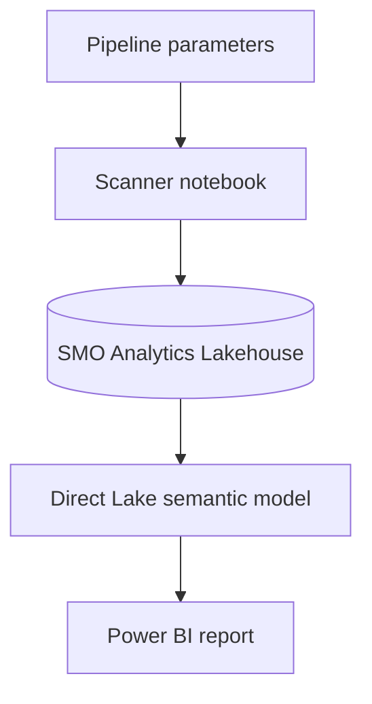
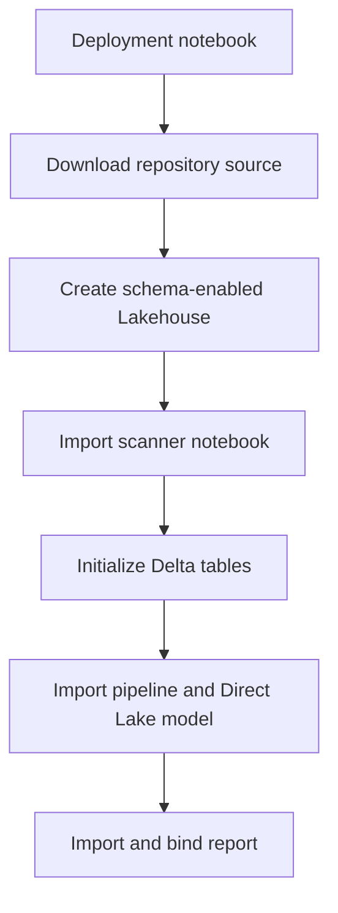

# Architecture

## Operating model

The solution separates deployment from recurring operation:

1. `Deploy_SMO_Analytics.ipynb` creates or updates all Fabric items.
2. The scanner initializes the governed Delta contract once.
3. `Load_SMO_Data` runs the scanner for a supplied workspace/model scope.
4. The Direct Lake semantic model reads the Lakehouse tables.
5. The Power BI report exposes operational and optimization findings.

This follows the FUAM deployment pattern: configuration-driven ordering, source-ID to target-ID replacement, name-based update behavior, and post-deployment initialization.

## Runtime flow

## Deployment flow

## Identity

V0.1 uses the signed-in Fabric user (`auth_mode = "user"`). A pipeline-triggered notebook runs under the identity of the pipeline's last modifying user. The initial POC therefore expects a tenant/Fabric administrator account with target-workspace and XMLA access.

Service-principal modes remain in the scanner for later unattended operation, but secrets must come from Key Vault and never from committed source.

## Lakehouse schemas

Schemas are enabled. Scanner tables are stored as `smopt.smopt_<logical_name>`. This matches the notebook's existing V1.2 contract and provides a clean namespace for future operational or remediation tables.

