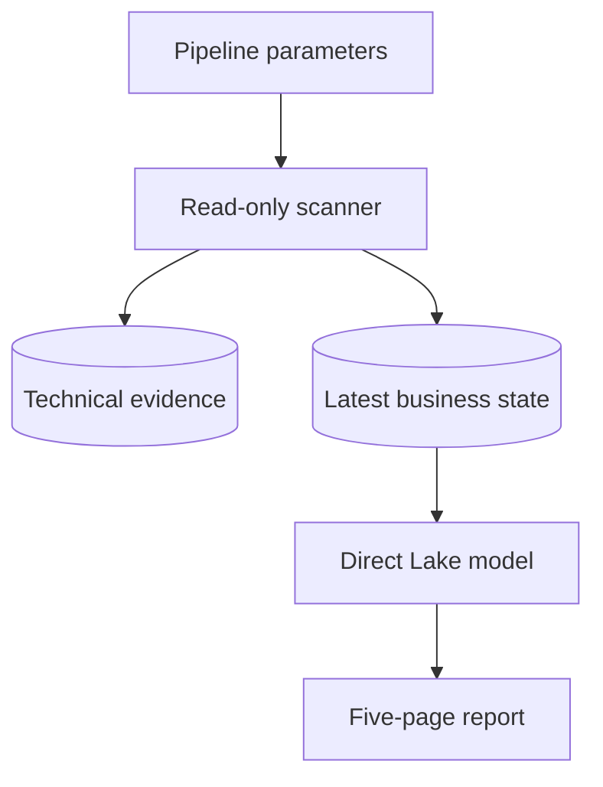
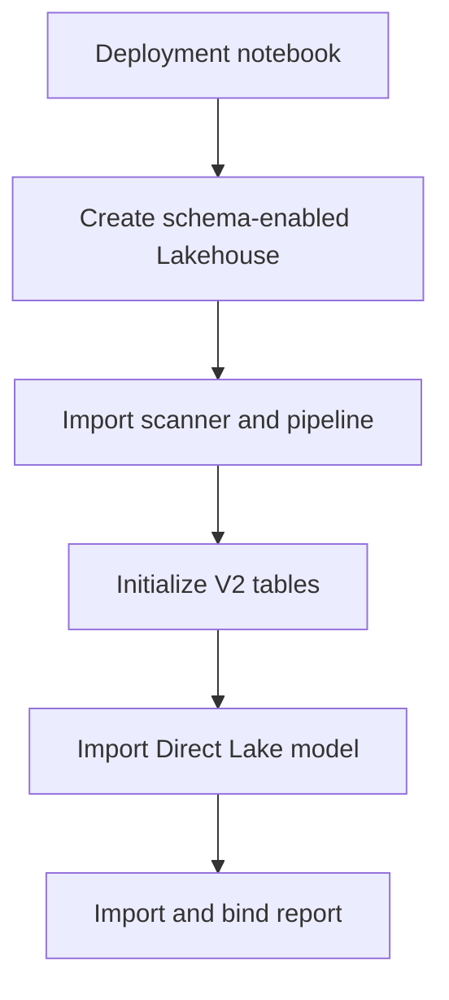

# Architecture

## Operating model

The solution separates deployment, recurring discovery, and benefit validation:

1. `Deploy_SMO_Analytics.ipynb` creates or updates all Fabric items.
2. The scanner initializes the technical evidence and V2 business contracts once.
3. `Load_SMO_Data` runs the scanner for an explicit workspace/model scope.
4. The scanner preserves technical history and refreshes each model's latest usable business state.
5. The Direct Lake semantic model reads seven meaningful consumption tables.
6. The five-page report presents opportunities, recommendations, findings, and storage evidence.
7. CU savings, if pursued, are measured separately with controlled before/after capacity metrics.

## Runtime flow

## Deployment flow

## Identity

The current POC defaults to the signed-in Fabric user (`auth_mode = "user"`). A pipeline-triggered notebook runs under the identity of the pipeline's last modifying user, which must have target-workspace and XMLA access.

Service-principal modes remain available for later unattended operation. Secrets must come from Key Vault and must never be committed.

## Lakehouse organization

The V2 report/AI contract uses the approved business schemas `analysis_control`, `semantic_model_metadata`, `semantic_model_vertipaq`, `semantic_model_best_practice`, and `semantic_model_optimization`. Seven business tables are exposed by Direct Lake. The deprecated `smopt` namespace remains a technical history layer only.

Optional evidence is explicit rather than silently blank. For example, Import models record Direct Lake checks as `NOT_APPLICABLE`; the standard profile records object-usage analysis as `NOT_RUN`; and a successful refresh-history call with no observations records a zero count plus a plain-language explanation.
