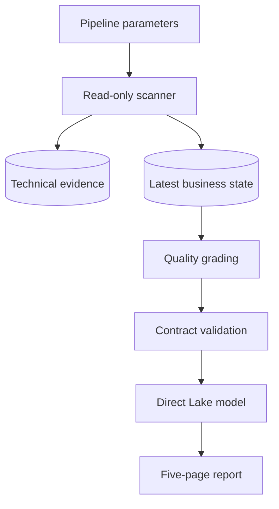
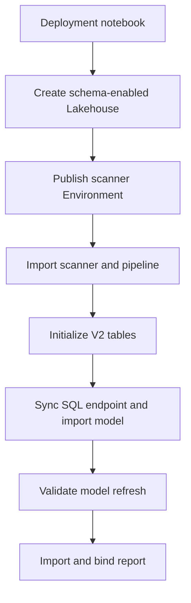

# Architecture

## Operating model

The solution separates deployment, recurring discovery, and benefit validation:

1. `Deploy_SMO_Analytics.ipynb` creates or updates all Fabric items.
2. A published Fabric Environment supplies the Semantic Link Labs extension without per-run installation; SemPy comes from the selected Fabric Runtime.
3. The scanner initializes the technical evidence and V2 business contracts once.
4. `Load_SMO_Data` runs the scanner for an explicit workspace/model scope.
5. The scanner preserves technical history and refreshes each model's latest usable business state.
6. Deterministic quality rules retain every finding while grading actionability, suppression, and implementation priority.
7. A post-scan quality gate validates required rows, overview/detail counts, latest-analysis consistency, opportunity rollups, link integrity, priority bands, and implementation guidance before the Pipeline can report success.
8. The Direct Lake semantic model uses one shared SQL endpoint expression, dynamically bound to the deployed Lakehouse SQL analytics endpoint ID and TDS connection string, to read eleven meaningful consumption tables centered on `semantic_models`.
9. The report presents five visible analysis pages, synchronized workspace/model filters, a top actionable recommendation queue, and a hidden opportunity drillthrough page.
10. CU savings, if pursued, are measured separately with controlled before/after capacity metrics.

## Runtime flow

The current implementation and acceptance baseline is the TEST tenant. PROD
Private Link and XMLA network reachability are tracked as an external environment
dependency and do not weaken the scanner's data-quality contract.

## Deployment flow

The scanner Notebook contains no `%pip` cell. Both standard and High Concurrency
Pipeline sessions use the attached `SMO_Scanner_Environment`; deployment waits for
its publish state and verifies that the required extension is present before the
scanner is imported. Exact package versions are diagnostic only. The scanner checks
the callable APIs required by its selected authentication mode and enabled analyses,
so a compatible Fabric Runtime is not rejected merely because its version differs.

## Identity

The current POC defaults to the signed-in Fabric user (`auth_mode = "user"`) and
the `workspace_user` scan profile. A pipeline-triggered notebook runs under the
identity of the pipeline's last modifying user, which must have target-workspace
and XMLA access. This default profile uses `sempy.fabric` workspace/model APIs and
the semantic-model XMLA surface only. It does not call Fabric Admin APIs and does
not require a Fabric or tenant administrator role.

Service-principal modes remain available for later unattended operation. Their
precheck proves effective access by resolving only the configured workspace and
listing semantic models inside that workspace; it does not enumerate tenant
workspaces, principals, or roles. Secrets must come from Key Vault and must never
be committed.

The optional `governance_admin` profile adds an item-access snapshot through
`list_item_access_details`. That is the only Fabric Admin API path. It is isolated
from core discovery and optimization status: a denied or unavailable governance
snapshot is retained as an enrichment warning and cannot downgrade a successful
BPA/VertiPaq analysis.

## Lakehouse organization

The V2 report/AI contract uses the approved business schemas `analysis_control`, `semantic_model_metadata`, `semantic_model_vertipaq`, `semantic_model_best_practice`, and `semantic_model_optimization`. Eleven business tables are exposed by Direct Lake. The deprecated `smopt` namespace remains a technical history layer only.

Direct Lake uses the deployed Lakehouse's SQL analytics endpoint for table
discovery, permission checks, and lineage; data remains in OneLake and no
on-premises data gateway is required. The deployment engine waits for the endpoint,
performs a selective metadata sync for all eleven source tables, validates every
table result (`Success`, or `NotRun` with a prior successful sync), binds the endpoint
by GUID, and treats a failed semantic-model refresh
as a failed deployment.

Optional evidence is explicit rather than silently blank. For example, Import
models record Direct Lake checks as `NOT_APPLICABLE`; the standard profile records
object-usage analysis as `NOT_RUN`; the `workspace_user` profile records item
access as `NOT_APPLICABLE_WORKSPACE_USER_PROFILE`; and a successful refresh-history
call with no observations records a zero count plus a plain-language explanation.
Unavailable capacity labels and model-size metadata are written under
`optional_enrichment_warnings` in the analysis error payload without changing the
core analysis status.
