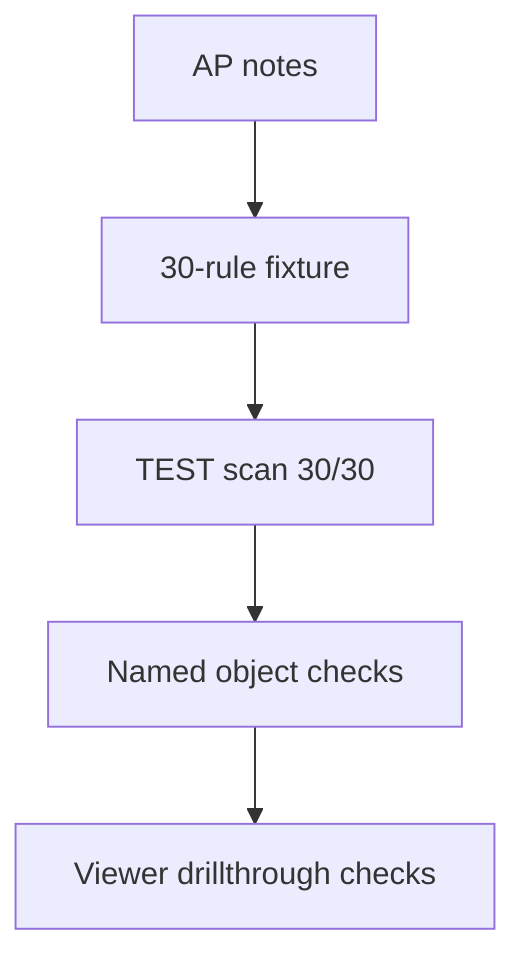

# M6.6.4 Report and anti-pattern revalidation

## Why the report gate was reopened again

Viewer review of solution `0.6.17` found that the consolidated workbench still
made several correctness assumptions that were not true in the Power BI Service:

1. a previously selected Review issues object slicer remained active after a new
   Start here drillthrough;
2. historical incomplete opportunities could appear with blank Priority/Decision
   and zero action/evidence counts;
3. Issue severity and evidence-row severity were labelled as though they were the
   same grain;
4. deployment initialization rewrote qualified object locators such as
   `FactInternetSales[OrderDateText]` back to bare names;
5. the AP-01 through AP-30 benchmark had been validated mainly by aggregate rule
   coverage rather than by the named injected objects that report viewers use.

M6.6.4 reopens both the report-correctness and adverse-model coverage gates. The
uploaded `Model_Antipattern_Notes(2).md` is the ground-truth acceptance inventory.

## Correctness changes

- Model-to-analysis relationships use `semantic_model_id | analysis_id` rather
  than the non-unique analysis ID alone.
- Opportunity-to-finding/action relationships use
  `semantic_model_id | analysis_id | opportunity_id`.
- Start, Issues, and Actions exclude incomplete historical rows with missing
  classification or zero visible evidence.
- Actions appears before Evidence everywhere.
- Issues labels its field **Max severity**, the maximum of supporting findings;
  Evidence labels each row **Evidence severity**.
- Column and measure locators are stored and displayed as `Table[Object]`; table
  findings retain the canonical table name.
- Deployment-time display backfill preserves qualified locators instead of
  replacing them with the raw leaf name.
- Start drillthrough explicitly passes only Model, Priority, and Decision.
- Review issues exposes **Back** and **Clear prior filters** actions.

Power BI Service saves reader slicer state independently of the source
drillthrough context. Therefore `acceptsFilterContext=None` does not clear a
previous target-page object selection. The report now states this behavior
directly and provides the one-click **Clear prior filters** action. After it is
used, the Model/Priority/Decision drillthrough filter remains active while the
saved object slicers are removed.

## AP-01 through AP-30 ground-truth matrix

| AP | Expected rule | Named acceptance signal | Result |
| --- | --- | --- | --- |
| AP-01 | `MQ001` | `vw_AllSales` wide disconnected fact-grain table | Pass |
| AP-02 | `MQ002` | `DimCustomerCopy` direct calculated-table copy | Pass |
| AP-03 | `MQ003` | `FactOrphanEmpty` disconnected table without measures | Pass |
| AP-04 | `MQ004` | `STG_TestLoad`, `TEMP_Calc`, `Dim_Calendar2` | Pass — all three verified in Viewer |
| AP-05 | `MQ005` | `FactInternetSales[OrderDateText]` with `FORMAT` | Pass — verified in Viewer |
| AP-06 | `MQ006` | fact calculated columns containing `RELATED` | Pass |
| AP-07 | `MQ007` | `FactInternetSales[SalesAmount_CalcCol]` | Pass |
| AP-08 | `MQ008`, `MQ023` | `DimProduct[RandomRank] = RAND()` / Double | Pass — verified in Viewer |
| AP-09 | `MQ009` | `DimCustomer[Name]`, `DimProduct[Name]` | Pass — both objects preserved in evidence |
| AP-10 | `MQ010` | `DimProduct[ProductAttributes]` concatenation | Pass — verified in Viewer |
| AP-11 | `MQ011` | `DimCustomer[YearlyIncomeText]` numeric `FORMAT` | Pass — verified in Viewer |
| AP-12 | `MQ012` | `zz_Info`, `Column9`, `JunkColumnUnused` naming | Pass |
| AP-13 | `MQ013`, `MQ025` | `DimDate[MonthFullName]` alias without sort | Pass |
| AP-14 | `MQ014` | dimension-hosted fact aggregation measure | Pass |
| AP-15 | `MQ015` | duplicate `Total Sales Amount` expression | Pass |
| AP-16 | `MQ016` | pass-through measure referencing only another measure | Pass |
| AP-17 | `MQ017` | hard-coded year filter measure | Pass |
| AP-18 | `MQ018` | `FILTER(ALL(...))` table scan | Pass |
| AP-19 | `MQ019` | numeric visible measure without format string | Pass |
| AP-20 | `MQ020` | Auto Date/Time tables, one model-level finding | Pass |
| AP-21 | `MQ021` | hidden relationship-participating table | Pass |
| AP-22 | `MQ022` | date-like tables with no marked date table | Pass |
| AP-23 | `MQ023` | Double/Real columns | Pass |
| AP-24 | `MQ024` | implicit aggregation on identifier/date sequence | Pass |
| AP-25 | `MQ025` | month-name string without `sortByColumn` | Pass |
| AP-26 | `MQ026` | exposed Fact/Dim prefixes | Pass |
| AP-27 | `MQ027` | high-cardinality fact text from VertiPaq evidence | Pass |
| AP-28 | `MQ028` | missing descriptions, consolidated by object type/sample | Pass |
| AP-29 | `MQ029` | implicit measures and/or missing roles/perspectives | Pass |
| AP-30 | `MQ030` | inactive relationship without `USERELATIONSHIP` | Pass |

The deterministic repository fixture fails if any `MQ001` through `MQ030` rule
becomes unreachable. It additionally asserts the exact AP-04/05/08/09/10/11
object pairs, because those were the object-level gaps reported during Viewer
review.

## TEST evidence

| Item | Accepted value |
| --- | --- |
| Workspace | `SMO Analytics - Dev` |
| Solution / scanner | `0.6.19` / `2.6.3` |
| Deployment | `SUCCEEDED`; initialization job `3a1e8fd9-bdbc-4d3f-a36f-6bf8715af617` |
| SQL source readiness | 11/11 tables; 8 refreshed, 3 already current |
| Semantic model refresh | `Completed` |
| Adverse analysis | `edf26ba7-29dc-4dde-a200-c2b15c77caa2`, `SUCCEEDED` |
| Control analysis | `15f0422b-259a-46ea-b7c3-6952b4e76e56`, `SUCCEEDED` |
| Adverse report baseline | 1,087 evidence rows, 19 root causes, 54 actions |
| Rule coverage | 30/30 (`MQ001` through `MQ030`) |
| Start priority scope | P2_HIGH/ACTIONABLE: 5 issues, 18 actions, 33 evidence |
| Saved-slicer reproduction | `DimCustomerCopy` incorrectly reduced the drillthrough to 2 actions / 2 evidence |
| Clear-prior-filters result | restored 5 issues / 18 actions / 33 evidence; model drillthrough scope retained |
| Back | returned from Review issues to Start here |
| Rescan during final hotfix deploy | none; existing accepted analyses were preserved |

Local acceptance also includes repository validation, Python compilation, PBIR
schema/authoring validation, and `git diff --check`.

M6.6.4 closes only after the final report-label change is deployed and the same
Viewer checks pass against the published report.
