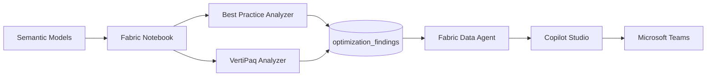
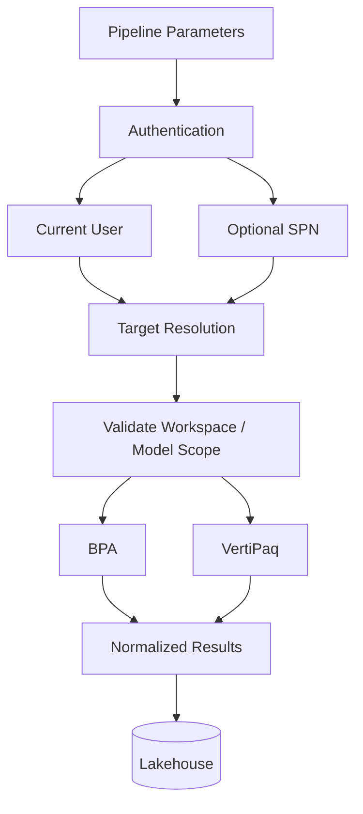
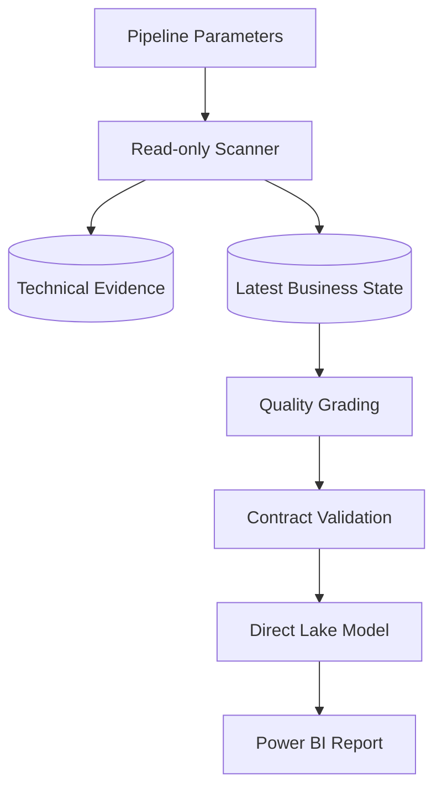

# Semantic Model Optimization Agent
## UC1a Technical Evaluation, Enterprise Adaptation, and Solution Evolution

**Document purpose:** Technical project record covering findings, architecture, implementation approach, validation, and recommendations.

**Reference implementation:** `SeanCowburnMSFT/Fabric-AI-Hackathon / Use Case 1a`

**Enterprise adaptation:** UC1a V0.x

**Advanced evolution:** `ZeonZheng/fabric-semantic-model-optimization`

---

# 1. Executive Summary

Microsoft's Fabric AI Hackathon UC1a demonstrates a strong end-to-end pattern for semantic-model optimization:

```text
Semantic Model
      |
      v
Deterministic Analysis
BPA + VertiPaq Analyzer
      |
      v
Lakehouse Findings
      |
      v
Fabric Data Agent
      |
      v
Copilot Studio
      |
      v
Microsoft Teams
```

The key architectural principle is sound: optimization advice should be grounded in deterministic technical analysis rather than generated from an LLM without evidence.

The source implementation is intentionally optimized for hackathon simplicity. During evaluation, several constraints were identified for enterprise reuse:

- tenant-wide inventory discovery depends on privileged Fabric Admin APIs;
- the discovered inventory becomes the default analysis workload;
- analyzing a broad model population can be expensive in runtime, CUs, and execution reliability;
- the original output normalizer intentionally compresses rich BPA/VertiPaq evidence into a simple agent-friendly findings contract;
- scope selection and operational control are limited compared with a reusable production-oriented workflow.

UC1a V0.x was therefore designed around explicit user intent rather than tenant inventory. It uses workspace IDs as the required scope, optional model IDs for narrower targeting, current-user-first authentication, optional service-principal support, and on-demand execution.

The later Semantic Model Optimization Analytics solution extends these lessons into a reusable Fabric solution with deployment automation, a published Fabric Environment, technical-history preservation, business-facing contracts, deterministic quality rules, Direct Lake analytics, Power BI reporting, and post-scan validation.

The engineering progression is summarized as:

```text
Microsoft UC1a
PROVE THE PATTERN
      |
      v
UC1a V0.x
CONTROL THE SCOPE
      |
      v
SMO Analytics
PRODUCTIZE THE WORKFLOW
```

---

# 2. Project Background and Objective

## 2.1 Business objective

The original use case targets a simple end-user experience: a Fabric developer should be able to ask how to make a semantic model faster or cheaper and receive concrete optimization findings based on actual model analysis.

The reference solution uses Semantic Link Labs as the deterministic analysis engine and then exposes the persisted findings through a conversational layer.

## 2.2 Project objectives

The internal project work therefore had several objectives:

1. Understand how the Microsoft UC1a notebook actually works.
2. Identify the permissions and Fabric identities required at each stage.
3. Evaluate whether the reference execution model is suitable for enterprise operation.
4. Adapt the execution path to normal-user and explicitly scoped use cases.
5. Validate the end-to-end flow from analysis to Lakehouse, Data Agent, Copilot Studio, and Teams.
6. Explore a more mature architecture for technical evidence, analytics, reporting, and repeatable deployment.

## 2.3 Evidence convention

This document distinguishes:

- **Source verified:** confirmed directly from repository code or documentation.
- **Project observation:** observed during implementation or TEST/PROD validation.
- **Engineering assessment:** an architectural conclusion based on the above evidence.

---

# 3. Microsoft UC1a Reference Implementation

## 3.1 Reference artifact

Repository:

- `https://github.com/SeanCowburnMSFT/Fabric-AI-Hackathon`

Relevant files:

- `Use Case 1a/readme.md`
- `Use Case 1a/uc1a-semantic-model-optimization.ipynb`

The notebook identifies itself as:

> UC1 v02 - Semantic Model Optimisation (All Workspaces, No Input)

It states that it iterates through all active workspaces and all semantic models it can discover, runs BPA and VertiPaq analysis, normalizes the findings, and persists the results to Lakehouse Delta tables.

## 3.2 End-to-end reference architecture



The reference README also describes storage-mode advice / Direct Lake checks at the conceptual level. The supplied notebook implementation is narrower and primarily implements BPA, VertiPaq analysis, normalization, and Lakehouse persistence.

## 3.3 Two-stage notebook execution model

The notebook is easiest to understand as two major technical stages followed by persistence.

### Stage 1 - Tenant inventory discovery

The notebook imports:

```python
import sempy.fabric.admin as admin
```

and builds the initial inventory using calls equivalent to:

```python
admin.list_workspaces(workspace_state="Active")
admin.list_items(item_type="SemanticModel", state="Active")
```

This creates a tenant-level workspace/model inventory.

**Source-verified implication:** elevated Fabric Admin or equivalent privileged service-principal access is introduced by the inventory-discovery mechanism.

### Stage 2 - Per-model analysis

The notebook then iterates over the inventory and executes, for each discovered model:

```python
labs.run_model_bpa(...)
labs.vertipaq_analyzer(...)
```

The actual BPA and VertiPaq analysis is therefore model-level Semantic Link Labs work, not a Fabric Admin API operation.

The important distinction is:

> Admin APIs are primarily used to discover the tenant inventory; the actual model analysis is performed per model.

However, the tenant inventory produced in Stage 1 becomes the default workload for Stage 2.

```text
Tenant inventory
      |
      v
for each discovered semantic model
      |
      +--> BPA
      |
      +--> VertiPaq
      |
      v
Normalized findings
```

The notebook explicitly warns that the loop may take a long time depending on environment size and suggests altering the code to use only a subset of workspaces and models.

## 3.4 Persistence

The original notebook writes two Delta tables:

- `optimization_findings`
- `optimization_runlog`

The run log preserves per-model BPA/VPA counts and errors, while the findings table is designed as a simple one-row-per-finding contract suitable for downstream Data Agent queries.

---

# 4. Technical Findings from the UC1a Evaluation

## F-01 - Privileged discovery dependency

**Evidence class:** Source verified

Tenant-wide inventory discovery uses `sempy.fabric.admin` functions.

**Impact:** A user who only needs to analyze models they are authorized to access inherits an elevated discovery dependency that is not inherently required by BPA or VertiPaq analysis itself.

**Engineering assessment:** Model analysis and tenant administration should be separated. A semantic-model optimization workflow should not require tenant-wide administrative visibility merely to determine the analysis target.

---

## F-02 - Discovery scope and analysis workload are coupled

**Evidence class:** Source verified

The original notebook discovers all active workspaces/models and then loops through that inventory.

```text
What can be discovered
        ||
        || becomes
        vv
What will be analyzed
```

This is convenient for a demonstration but creates poor operational control in a large environment.

**Engineering assessment:** Discovery should not automatically define workload. User intent and authorization should define workload.

Target architecture:

```text
User intent
    |
    v
Explicit workspace/model scope
    |
    v
Authorization / target resolution
    |
    v
Analysis workload
```

---

## F-03 - Tenant-wide model analysis has poor operational scaling characteristics

**Evidence class:** Source verified + project observation + engineering assessment

The Microsoft README already cautions that VertiPaq analysis on a very large model can consume meaningful CUs and memory. The notebook also warns that analyzing the whole discovered environment can take a long time.

**Project observation:** During TEST evaluation, a run involving approximately 70+ semantic models already required substantial execution time, even though the practical target set mainly reflected models accessible to the executing user. This observation is recorded as project evidence, not as a formal benchmark.

The workload is not a simple metadata listing. For each model, the notebook may need to establish model access and perform:

```text
Model N
  +--> XMLA / model access
  +--> BPA evaluation
  +--> VertiPaq analysis
  +--> normalization
  +--> persistence
```

As model count increases, the expensive part is not tenant inventory enumeration itself; it is using the inventory as the input to repeated model analysis.

### PROD-specific environmental factor

**Project observation:** PROD has Private Link enabled, and Fabric notebook/Spark node startup can consume a significant portion of the available execution window. This further reduces the useful time available for model analysis and increases timeout exposure.

**Engineering assessment:** Tenant-wide scheduled analysis was therefore rejected as the default operating model for this environment.

---

## F-04 - Rich analysis is reduced through lossy normalization

**Evidence class:** Source verified

The reference solution deliberately normalizes different analysis sources into a simple agent-friendly table. This makes conversational querying straightforward, but the transformation discards significant diagnostic detail.

### BPA normalization

The original mapping keeps a small set of generic fields, including:

- severity;
- object type;
- object name;
- rule;
- finding;
- recommended fix;
- workspace/model identity.

For BPA, `finding` and `recommended_fix` are frequently both derived from the rule description. This means the persisted contract does not necessarily contain a distinct remediation explanation separate from the original finding text.

### VertiPaq normalization

The original code:

1. prefers the `Columns` DataFrame from the VertiPaq result;
2. otherwise chooses the first DataFrame-like result;
3. finds a size or cardinality field;
4. sorts descending;
5. keeps only the top 15 rows;
6. emits a generic finding for those rows.

The persisted finding does not preserve the full metric set used to produce the ranking.

Conceptually:

```text
Rich VertiPaq evidence
  +-- table metrics
  +-- column metrics
  +-- size
  +-- cardinality
  +-- encoding
  +-- dictionary/storage detail
  +-- other analyzer outputs
            |
            v
      Simplified extraction
            |
            v
        Top 15 rows
            |
            v
Generic optimization finding
```

---

## F-05 - VertiPaq finding classification is intentionally generic

**Evidence class:** Source verified

For retained VertiPaq rows, the notebook uses fixed classification values such as:

```text
Severity: Warning
Rule: High size / cardinality
Finding: Large contributor to model size
Recommended fix: Reduce cardinality, remove unused columns, or aggregate
```

The detailed metric values are used mainly to rank candidate columns, not to create a rich diagnostic evidence record.

**Engineering assessment:** This is effective for a fast end-to-end agent demo but insufficient as the only data contract for deeper root-cause analysis, reporting, prioritization, trend analysis, and before/after validation.

---

## F-06 - Agent-friendly simplicity trades analytical depth for usability

**Evidence class:** Source verified + engineering assessment

The Microsoft README explicitly explains why one row per finding is useful: it enables simple top-N Agent queries and fits the conversational pattern well.

Therefore the simplification should be treated as a deliberate hackathon trade-off rather than simply as a coding defect.

### Strong fit

- demonstration;
- simple Q&A;
- top-N findings;
- quick Data Agent grounding.

### Limited fit

- detailed root-cause diagnostics;
- raw evidence preservation;
- trend analysis;
- priority calibration;
- remediation validation;
- rich Power BI reporting;
- production operational lifecycle.

---

## F-07 - Reference implementation is a pattern demonstrator rather than a complete operational solution

**Evidence class:** Engineering assessment

The reference implementation successfully proves the end-to-end architectural concept. However, several choices are optimized for hackathon speed and simplicity:

- privileged broad discovery;
- no explicit model-selection input;
- inventory-driven workload;
- simplified/lossy findings contract;
- generic VertiPaq classification;
- notebook-centric operation;
- limited scheduling, retry, resumability, and production-hardening controls.

This conclusion is not a criticism of the architectural pattern. It identifies the engineering work required to reuse the pattern safely and efficiently in an enterprise environment.

---

# 5. Why UC1a V0.x Was Created

The V0.x adaptation was driven by four engineering concerns.

## 5.1 Least privilege

Avoid tenant-wide administrative discovery when the user only needs to analyze explicitly approved workspaces/models.

## 5.2 Explicit scope

Allow the caller to state what should be analyzed.

## 5.3 Compute efficiency

Avoid running BPA/VertiPaq unnecessarily across a broad model population.

## 5.4 Execution reliability

Reduce the probability that long-running notebook analysis and environment-startup overhead consume the execution window or create incomplete/timeout-prone runs.

The resulting operating principle is:

> **Deploy broadly. Scan narrowly.**

A related architecture principle is:

> **Discovery no longer defines workload. User intent defines workload.**

---

# 6. UC1a V0.x Design

## 6.1 Parameter model

V0.x introduces simple pipeline-friendly inputs:

```text
workspace_ids       REQUIRED
model_ids_optional  OPTIONAL
```

The interface is intentionally simple and avoids forcing ordinary users to construct JSON payloads.

## 6.2 Two execution modes

### Workspace scope mode

```text
workspace_ids       = W1,W2
model_ids_optional  = blank
```

The scanner resolves eligible semantic models only inside the requested workspace(s).

### Explicit model target mode

```text
workspace_ids       = W1
model_ids_optional  = M1,M2
```

Only the explicitly requested model targets are analyzed.

## 6.3 Identity model

The default direction is current-user-first execution:

```text
Signed-in user / pipeline identity
              |
              v
Explicit workspace scope
              |
              v
Authorized semantic models
              |
              v
BPA + VertiPaq
```

An optional service-principal path supports future unattended automation without making SPN setup a prerequisite for normal interactive use.

## 6.4 Reuse rather than rewrite

The adaptation deliberately reuses the valuable deterministic engine:

- Semantic Link / SemPy;
- Semantic Link Labs;
- `run_model_bpa()`;
- `vertipaq_analyzer()`.

The primary redesign effort is in:

- identity;
- scope resolution;
- parameterization;
- orchestration;
- validation;
- persistence behavior;
- operational control.

---

# 7. V0.x Architecture



The key change is the security and workload boundary:

```text
Microsoft reference
Tenant discovery --> inventory --> analysis

V0.x
User intent --> explicit scope --> authorized targets --> analysis
```

---

# 8. Implementation Approach

## 8.1 Pipeline as the operational entry point

The user should not need to open a notebook, edit variables, understand code cells, and manually manage execution order.

Preferred pattern:

```text
User
  |
  v
Fabric Pipeline
  |
  v
Scanner Notebook
  |
  v
Lakehouse
```

## 8.2 On-demand scanning

The default workflow is intentionally not a tenant-wide nightly scan. Users provide the workspace/model scope they need to evaluate.

This design improves:

- predictable workload;
- CU control;
- execution duration;
- timeout resilience;
- security clarity;
- troubleshooting usability.

## 8.3 Read-only analysis

The scanner is designed to inspect and report; it does not automatically change the target semantic models.

This separates analysis from future remediation/approval workflows.

---

# 9. Engineering Journey and Validation

The project work included more than notebook modification. The engineering path included:

```text
Reference repository analysis
        |
        v
Original notebook validation
        |
        v
Permission and identity investigation
        |
        v
TEST execution
        |
        v
PROD environment investigation
        |
        v
Private Link / runtime analysis
        |
        v
V0.x scoped redesign
        |
        v
Pipeline and target-resolution validation
        |
        v
Lakehouse + Data Agent + Copilot Studio + Teams
        |
        v
Advanced solution and regression validation
```

Validation areas have included:

- discovery behavior;
- normal-user operation;
- workspace-scoped targeting;
- explicit-model targeting;
- BPA execution;
- VertiPaq execution;
- Lakehouse persistence;
- Data Agent querying;
- Copilot Studio connection;
- Teams publication;
- anti-pattern and control-model validation in the later SMO Analytics solution.

---

# 10. Evolution into Semantic Model Optimization Analytics

The advanced repository evolves the earlier scanner concept into an FUAM-style Fabric solution.

## 10.1 Solution components

On branch `codex/m6-4`, the repository defines a solution containing:

- `SMO_Analytics_Lakehouse`;
- `SMO_Scanner_Environment`;
- `SMO_Optimization_Scanner`;
- `Load_SMO_Data`;
- `SMO_Analytics_SM`;
- `SMO_Analytics_Report`.

The deployment notebook creates or updates the complete solution. Normal operation then uses only the parameterized `Load_SMO_Data` pipeline.

## 10.2 Advanced operating model



The advanced solution separates:

- deployment;
- runtime collection;
- technical evidence/history;
- latest business state;
- quality grading;
- contract validation;
- analytical consumption;
- benefit validation.

## 10.3 Identity evolution

The current `workspace_user` profile uses the signed-in identity and workspace/model APIs only. It does not enumerate tenant workspaces, members, or items through Fabric Admin APIs.

An explicit `governance_admin` profile isolates the optional Fabric Admin path for governance enrichment rather than making it part of core model scanning.

## 10.4 Evidence preservation

The advanced solution preserves technical evidence and exposes a structured business contract rather than collapsing all analysis into one generic findings table.

The later architecture includes business schemas for:

- analysis control;
- semantic-model metadata;
- VertiPaq evidence;
- best-practice evidence;
- optimization outputs.

This creates a stronger foundation for reporting, root-cause grouping, prioritization, validation, and future Agent experiences.

---

# 11. Architecture Decisions

| ID | Decision | Selected approach | Rationale |
|---|---|---|---|
| ADR-01 | Scan scope | Explicit workspace/model scope | Runtime, CU, security, and control |
| ADR-02 | Default identity | Current user / effective pipeline identity | Least privilege and usability |
| ADR-03 | Automation identity | Optional SPN | Supports unattended operation without blocking user execution |
| ADR-04 | Analysis engine | Reuse Semantic Link Labs | Proven deterministic engine |
| ADR-05 | User input | Simple IDs, not complex JSON | Lower user barrier |
| ADR-06 | Operational entry point | Fabric Pipeline | Hide notebook complexity |
| ADR-07 | Default scheduling | On demand | Better cost and execution reliability |
| ADR-08 | Data architecture | Preserve technical evidence plus business contract | Avoid premature information loss |
| ADR-09 | Analytics | Direct Lake semantic model + Power BI | Fabric-native consumption |
| ADR-10 | Remediation | Separate from read-only scanning | Preserve control and approval boundaries |

---

# 12. Recommendations

## R-01 - Keep scoped scanning as the default

Avoid routine tenant-wide BPA/VertiPaq analysis. Allow explicit workspace/model scope to control the workload.

## R-02 - Separate discovery from workload definition

The fact that an identity can discover a model does not imply that the model should be analyzed in the current run.

## R-03 - Preserve raw technical evidence

Use a layered data model:

```text
Technical evidence
       |
       v
Deterministic interpretation / rules
       |
       v
Business findings / actions
```

Do not discard the raw values needed later for root-cause analysis and validation.

## R-04 - Keep deterministic analysis as the technical source of truth

Use rules, metadata, and measured model evidence to generate findings. Use AI for explanation, navigation, prioritization support, and conversation rather than for inventing technical facts.

## R-05 - Treat CU savings as a separate validation exercise

Estimated optimization value should remain directional until supported by controlled before/after capacity measurements.

## R-06 - Keep optional governance enrichment isolated

Admin-only enrichment should not be allowed to turn an otherwise successful model optimization scan into a failed scan.

---

# 13. Known Limitations and Future Work

Recommended future work includes:

- formal large-scale runtime/CU benchmarking;
- incremental or change-based scan strategies;
- controlled concurrency and batching;
- scan timeout and resumability strategy;
- PROD Private Link / XMLA reachability validation;
- SPN governance and Key Vault operating model;
- before/after benefit measurement;
- approval-controlled remediation workflow;
- Agent integration over richer evidence and business contracts.

---

# 14. Conclusion

Microsoft UC1a successfully demonstrates the core architecture pattern:

> deterministic semantic-model analysis can be converted into trusted, conversational optimization guidance.

The internal engineering work extends that pattern in two steps:

```text
Microsoft UC1a
Proved the pattern
      |
      v
UC1a V0.x
Controlled identity and scope
      |
      v
SMO Analytics
Productized the operating model and analytical workflow
```

The primary engineering contribution is therefore not replacing the deterministic optimization engine. It is adapting identity, scope, workload, evidence preservation, validation, deployment, and consumption architecture for enterprise use.
